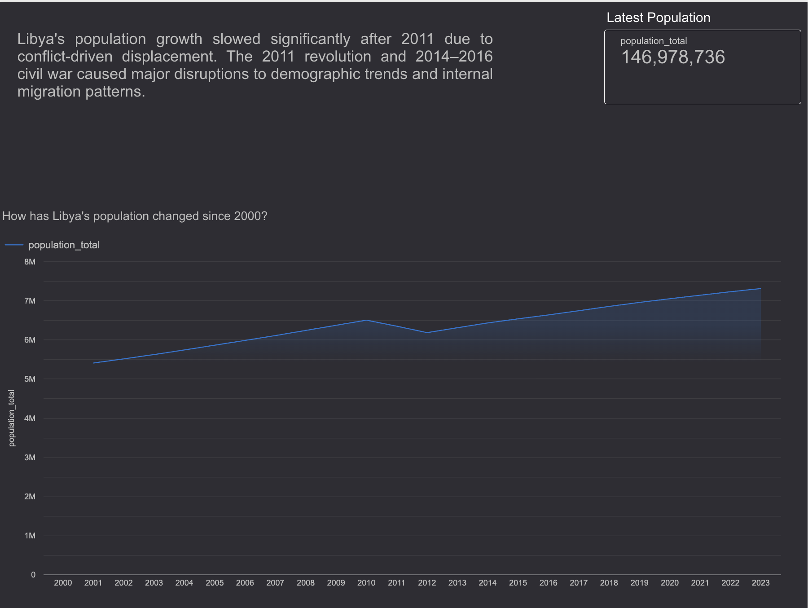
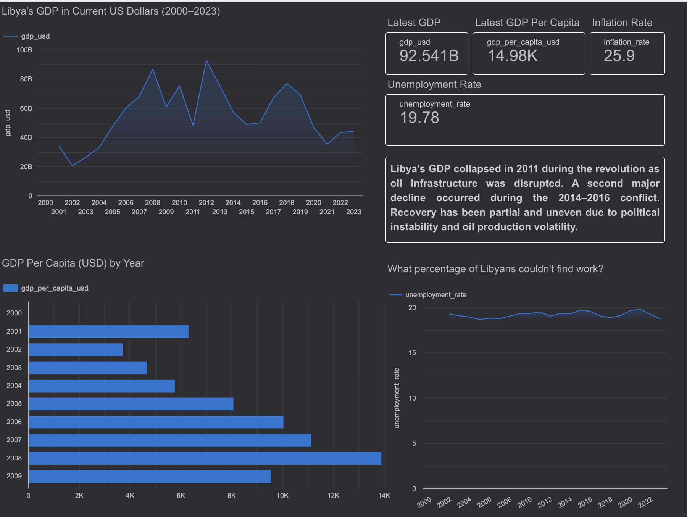
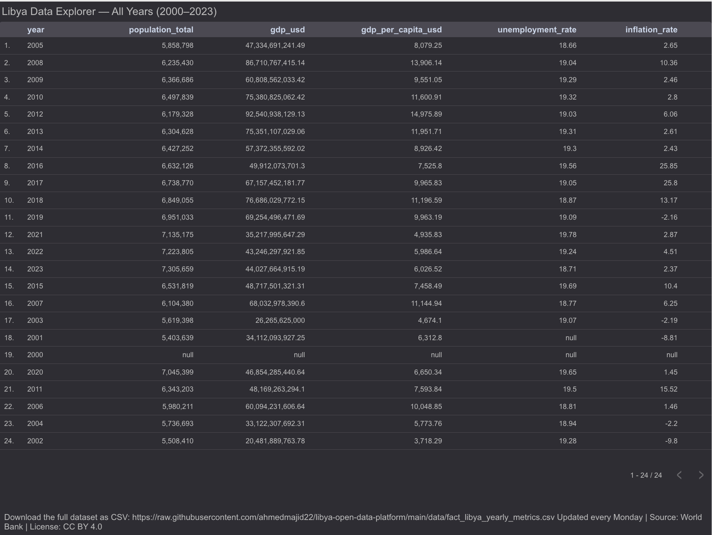

# 🇱🇾 Libya Open Data Platform


> Automated data pipeline that collects, transforms, and publishes open data about Libya.

---

## 🚀 Project Overview

This project is an end-to-end data engineering pipeline that collects, transforms, and visualizes macroeconomic and demographic data for Libya.

### Key Features
- Automated data ingestion from World Bank APIs
- Data transformation using dbt (staging + mart layers)
- Data warehousing in Google BigQuery
- Interactive dashboards built with Looker Studio
- Automated testing with 13+ data quality checks
- Weekly data updates via GitHub Actions

### Business Value
This platform enables:
- Monitoring of Libya’s economic performance over time
- Analysis of population trends and demographic shifts
- Identification of major disruptions (e.g., 2011 revolution, 2014–2016 conflict)
- Public access to clean, structured, and visualized data

---

## 📊 Interactive Dashboard

Explore the live dashboard:  
👉 https://datastudio.google.com/reporting/ca23d690-a8b4-4506-8a39-f980855fd765

---

### Population Trends



---

### Economic Indicators



---

### Full Data Explorer



---

## What This Does

- Extracts data from the **World Bank API** every Monday  
- Transforms data using **dbt** (staging + mart layers)  
- Runs automated data quality tests  
- Publishes a clean CSV to this repository  

---

## Data

The public dataset is available in the `/data` folder:

- [fact_libya_yearly_metrics.csv](data/fact_libya_yearly_metrics.csv)

**Direct download URL:**  
https://raw.githubusercontent.com/ahmedmajid22/libya-open-data-platform/main/data/fact_libya_yearly_metrics.csv

---

## Stack

- **Ingestion:** Python + World Bank API  
- **Warehouse:** Google BigQuery  
- **Transformation:** dbt (staging + mart)  
- **Visualization:** Looker Studio  
- **Automation:** GitHub Actions (weekly)  
- **Data Sources:** World Bank Open Data, UNHCR (Phase 2)  

---

## Project Structure

```bash
libya-open-data-platform/
├── .github/workflows/      # GitHub Actions pipeline
├── data/                   # Public CSV exports (auto-updated weekly)
├── dbt_libya/
│   ├── models/
│   │   ├── staging/        # stg_worldbank (view)
│   │   └── mart/           # fact_libya_yearly_metrics (table)
│   ├── tests/              # Data quality tests
│   └── macros/             # dbt macros
├── docs/                   # Dashboard screenshots 
├── ingestion/              # Python extract + load scripts
├── README.md
├── DISCLAIMER.md
└── LICENSE
```

---

## Pipeline Workflow

1. **Extract** → Fetch data from World Bank API  
2. **Load** → Store raw data in BigQuery  
3. **Transform** → Apply dbt models (staging → mart)  
4. **Test** → Run data quality checks  
5. **Publish** → Export clean dataset to `/data`  

⏱ Runs automatically every **Monday via GitHub Actions**

---

## Future Improvements

- Integrate **UNHCR datasets**  
- Add **dashboards (Looker Studio / Power BI)**  
- Implement **data versioning**  
- Expand to additional **open data sources**  

---

## License & Disclaimer

- See `LICENSE` for usage terms  
- See `DISCLAIMER.md` for data limitations  